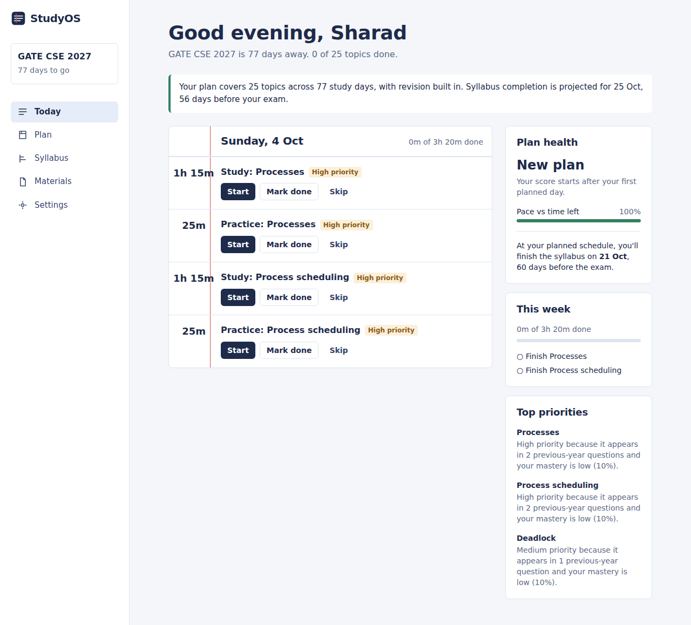
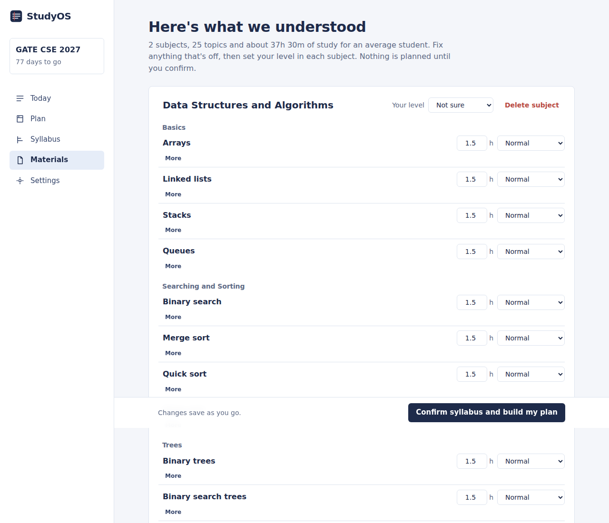
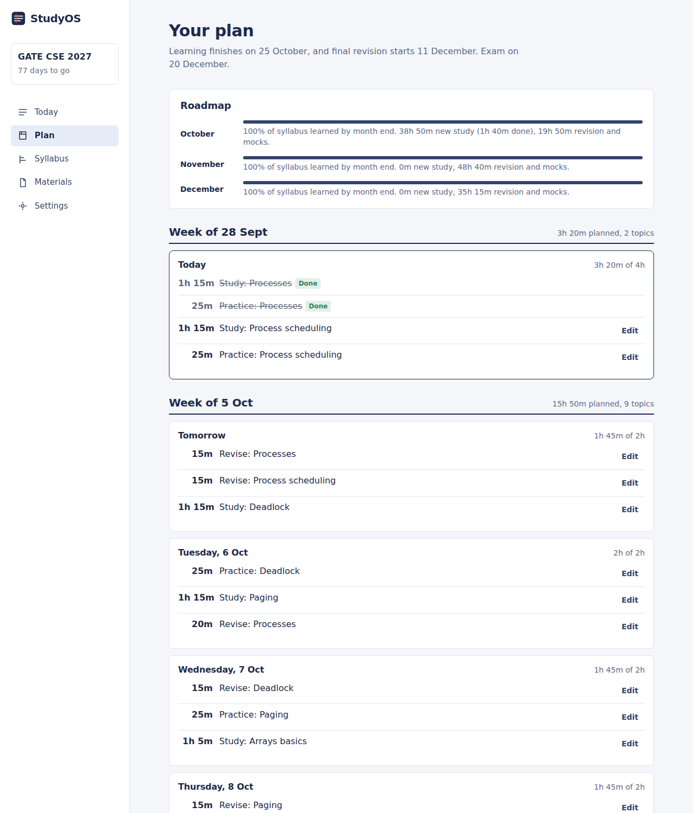
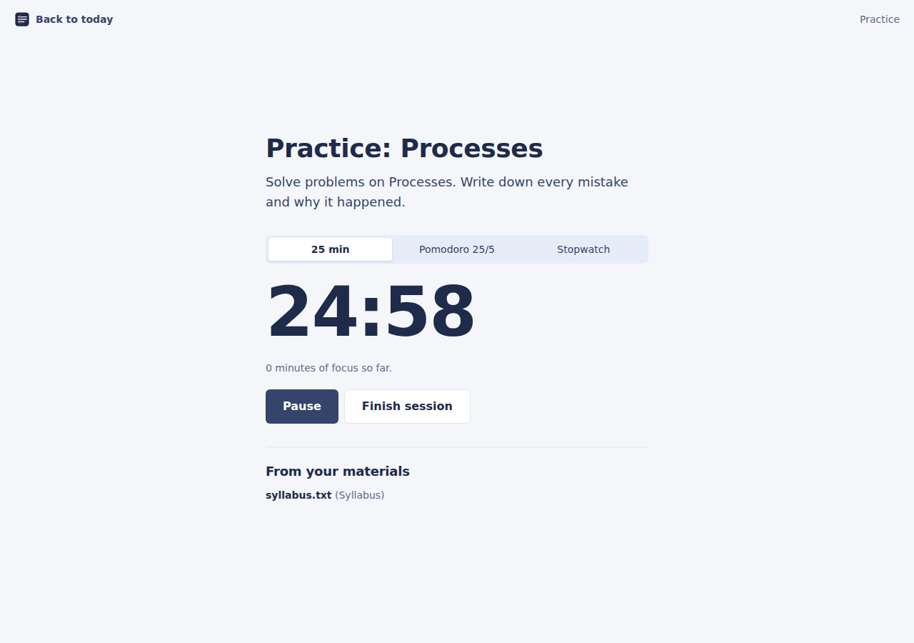

# StudyOS

AI-powered adaptive study planning and learning intelligence platform.

Built by **Sharad Singh Kushwaha**, Sharad Solutions

---

## Why I built StudyOS

Students don't usually struggle because they lack resources. They struggle because they have too many (syllabus PDFs, notes, books, lectures, previous-year papers) and no system that turns them into a realistic plan.

> "Mujhe exactly kya padhna hai, kis order mein padhna hai, kitna padhna hai, aur exam tak kaise complete karna hai?"

StudyOS answers that question every morning. It transforms

```
Syllabus + Notes + PYQs + Available time + Student progress
```

into

```
Personalized roadmap + Daily tasks + Revision + Practice + Adaptive replanning
```

## What works today (v1.0)

| Area | What it does |
| --- | --- |
| Accounts | Email/password and Google sign-in. Every query is scoped to the signed-in user. |
| Onboarding | Exam type, date, target, daily study hours per weekday, preferred times, learning style. |
| Materials | Upload up to 20 PDF, DOCX or TXT files at once by selecting several or dragging them in. Each file's type (syllabus, previous-year paper, question bank, textbook, notes, revision notes) is detected from its **content**: exam headers, marks and time limits mark a past paper; units, credits and course outcomes mark a syllabus; an ISBN and preface mark a textbook. The app shows the evidence ("It shows maximum marks, states a time limit…"), never overrides a type the student chose, and suggests a change when the content disagrees. Uploads run 3 at a time with progress bars, failed files can be retried, and duplicates are skipped. The server reads at most 3 files at a time per instance and resumes files interrupted by a restart. The UI shows real pipeline states (queued, reading text, indexing pages, ready). Scanned PDFs are detected by text-extraction confidence and flagged. All syllabus files are merged into one topic map, and every previous-year paper counts toward priorities. |
| Topic map | Claude extracts subjects, chapters, topics, prerequisites, difficulty and time estimates. Without an API key, a rule-based parser does it. Duplicate topics ("Binary Search" / "binary searching") are merged with aliases. |
| Human-in-the-loop review | Rename, merge, delete, reorder, add topics and subjects, edit prerequisites, set importance and your level per subject. No plan is made until you confirm. |
| Priority engine | Weighted, normalised score from syllabus importance, PYQ frequency, prerequisite centrality, weakness and difficulty, with a plain-language reason for every topic. |
| Planner | Deterministic. Never exceeds daily hours, never schedules on unavailable days or after the exam, finishes prerequisites first, reserves a buffer, adds spaced revision, fills spare weeks with revision rounds and weekly mocks, and protects a final revision window. Work that doesn't fit is reported, never crammed. |
| Today | A notebook-style daily sheet. Start, mark done with a difficulty rating, or skip. |
| Focus mode | Countdown, Pomodoro 25/5 or stopwatch, the session objective, and the files and pages in your own materials where the topic appears. |
| Progress | Topic mastery (0–100) and status from completed sessions and ratings. Weak topics get extra revision automatically. |
| Adaptive replanning | Detects missed work, previews the new plan in plain language ("You're 5h 20m behind…"), and applies it only after you confirm. Tasks you edited are pinned and never moved. |
| Plan health | Score from completion, pace, consistency and revision, plus an on-track prediction against the exam date. |
| Plan view | Monthly roadmap, weekly goals, every day's tasks with load vs. capacity, and manual edits. |

### Screenshots

| Today | Topic review |
| --- | --- |
|  |  |

| Plan | Focus mode |
| --- | --- |
|  |  |

_Captured from an automated end-to-end run. Fonts fall back to system fonts in that environment; retake them locally for the final README._

## Architecture

```
Browser (Next.js App Router, React 19, Tailwind 4)
  │  server components + server actions + 3 route handlers
  ▼
Next.js server
  ├── Auth.js v5 (credentials + Google, JWT sessions)
  ├── Document pipeline: validate → store → extract (unpdf / mammoth) → confidence check → page-aware chunks
  ├── Syllabus intelligence: Claude (JSON, validated with zod) or rule-based parser → dedupe → draft
  ├── Priority engine: signals → normalised weighted score → reasons
  ├── Planner: priority-aware topological order → day-by-day allocation → revision / mocks / final window
  ├── Replanner: rebuilds from today around completed and pinned work → preview → confirm → apply
  └── Health: completion, pace, consistency, revision → score + completion prediction
  ▼
PostgreSQL (Prisma 7, driver adapter) + pgvector column reserved for embeddings
```

### Code map

```
src/
  app/                    pages, layouts, API routes
    (auth)/               login, signup, auth server actions
    (app)/                signed-in shell: dashboard, plan, syllabus, topics, setup, settings
    study/[taskId]/       focus mode
    api/documents/        upload, status polling, file viewer
  actions/                server actions (exam, documents, syllabus, tasks, plan, settings)
  lib/
    planner/              graph, priority, schedule, health, service  ← the core engine
    syllabus/             AI extraction, heuristic parser, normalisation
    documents/            extraction, chunking, processing pipeline
    pyq/                  question splitting and topic frequency
  components/             UI
prisma/schema.prisma      data model
tests/                    planner and parser tests (vitest)
```

### Planning engine

`src/lib/planner/schedule.ts` is a pure function: same input, same plan.

1. Build study days between today and the exam, minus unavailable days, minus the buffer, minus time already taken by pinned tasks.
2. Reserve a final revision window (about 12% of study days).
3. Order topics with a priority-aware topological sort. A prerequisite inherits the urgency of the most important topic that needs it, so foundations aren't left until the end. Cycles are broken and reported.
4. Fill each day: due spaced-repetition revisions first (capped share of the day), then learning and practice sessions (25–90 minutes, at most 2 hours of one topic per day).
5. Once the syllabus is learned, spare days get revision rounds by priority and a weekly mock, using at most 75% of the day.
6. Final window: mock tests on alternate days and revision of the highest-priority topics.
7. Anything that doesn't fit is returned as `unscheduled` with a warning.

Hard constraints (never violated): exam date, daily capacity, unavailable days, prerequisites, completed and pinned work. Soft constraints (optimised): priority, revision spacing, topic diversity, workload balance.

### AI usage

- Syllabus extraction uses the Anthropic API when `ANTHROPIC_API_KEY` is set. The prompt forbids inventing topics, and the response is validated and clamped with zod. If the call fails, the built-in parser takes over and the user is told.
- Planning, priorities, health and replanning are deterministic code, not LLM output, so plans are reproducible and explainable.

### RAG status

Documents are already split into page-aware chunks stored in `document_chunks`, which powers page citations for each topic today (keyword match). The `embedding vector(1024)` column is reserved. Next: an embedding job, hybrid vector + keyword retrieval with metadata filters, reranking, and a grounded study coach.

## Getting started

Requirements: Node.js 20.19+ (22 recommended) and PostgreSQL 15+ with the `pgvector` extension (Supabase and Neon both work).

```bash
git clone https://github.com/absolutely-sharad/studyos.git
cd studyos
cp .env.example .env          # fill in DATABASE_URL and AUTH_SECRET
npm install                   # also runs prisma generate
npm run db:migrate -- --name init
npm run dev                   # http://localhost:3000
```

Generate `AUTH_SECRET` with `npx auth secret`.

Run checks:

```bash
npm test            # planner and parser tests
npm run typecheck
npm run build
```

### Environment variables

| Variable | Required | Purpose |
| --- | --- | --- |
| `DATABASE_URL` | Yes | PostgreSQL connection string |
| `AUTH_SECRET` | Yes | Session signing secret |
| `AUTH_GOOGLE_ID`, `AUTH_GOOGLE_SECRET` | No | Shows "Continue with Google" when both are set |
| `ANTHROPIC_API_KEY` | No | AI syllabus extraction; the built-in parser is used without it |
| `ANTHROPIC_MODEL` | No | Defaults to `claude-sonnet-5-5` |
| `UPLOAD_DIR` | No | Local upload folder, defaults to `.uploads` |
| `PROCESSING_CONCURRENCY` | No | Files read at the same time per server instance, defaults to 3 |
| `NEXT_PUBLIC_DEVELOPER_NAME`, `NEXT_PUBLIC_COMPANY_NAME`, `NEXT_PUBLIC_GITHUB_URL` | No | Attribution (defaults set) |
| `NEXT_PUBLIC_LINKEDIN_URL` | No | LinkedIn link; hidden until set |
| `SECURITY_CONTACT_EMAIL` | No | Shown in SECURITY.md process |

### Deploying

Works on Vercel, Railway or any Node host. Before production:

- Replace local-disk storage in `src/lib/storage.ts` with S3, Cloudflare R2 or Supabase Storage. Serverless file systems are not persistent.
- Move document processing to a queue (Inngest, BullMQ or Trigger.dev) for large files.
- Set `AUTH_URL` to your domain if your host requires it.

## API surface

| Route | Method | Purpose |
| --- | --- | --- |
| `/api/auth/*` | GET, POST | Auth.js |
| `/api/documents` | GET | Documents and processing status for the active exam |
| `/api/documents` | POST | Multipart upload (`file`, `category`), processing starts after response |
| `/api/documents/[id]/file` | GET | Owner-only file viewer, supports `#page=N` for PDFs |

Everything else is a typed server action in `src/actions/`, each of which checks the session and ownership.

## Engineering decisions

- **Deterministic planner, AI at the edges.** LLMs read messy syllabi well, but schedules must be reproducible, constraint-safe and explainable, so planning is plain TypeScript with tests.
- **Human confirmation before planning.** Extraction mistakes are fixed on the review screen instead of silently shaping weeks of study.
- **Preview before replanning.** Major plan changes are shown in plain language and applied only after confirmation. User edits are pinned (`source = USER`).
- **Graceful degradation.** No AI key, no PYQs, or no prerequisites still produce a sensible plan. Signals with no data are excluded from the priority score rather than counted as zero.
- **Dates as calendar keys.** Study days are `YYYY-MM-DD` in the student's timezone, stored as `DATE`, which avoids timezone drift around midnight.

## Roadmap

- [ ] LLM fallback for document types the rules can't decide
- [ ] OCR for scanned PDFs (Tesseract or a vision model), with page numbers
- [ ] Embeddings + hybrid retrieval (pgvector) and an AI study coach with tool calls and citations
- [ ] PYQ intelligence with an LLM: year, marks, question type, trends, PYQ dashboard
- [ ] Practice engine: generated quizzes, mistake analysis, accuracy feeding mastery
- [ ] Reminders: in-app, email and browser notifications with quiet hours
- [ ] Calendar view with drag and drop
- [ ] Global natural-language search
- [ ] External resource recommendations (opt-in, real sources only)
- [ ] Admin and observability

## Author

### Sharad Singh Kushwaha

Founder / Builder, Sharad Solutions

GitHub: https://github.com/absolutely-sharad

LinkedIn: configured through `NEXT_PUBLIC_LINKEDIN_URL`

---

© 2026 Sharad Solutions. StudyOS — AI-powered adaptive learning. No license has been selected yet; all rights reserved by default.
# studyos
